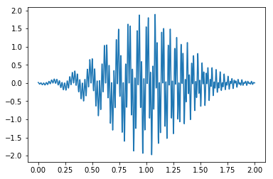
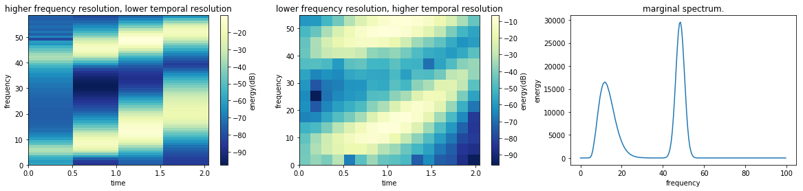
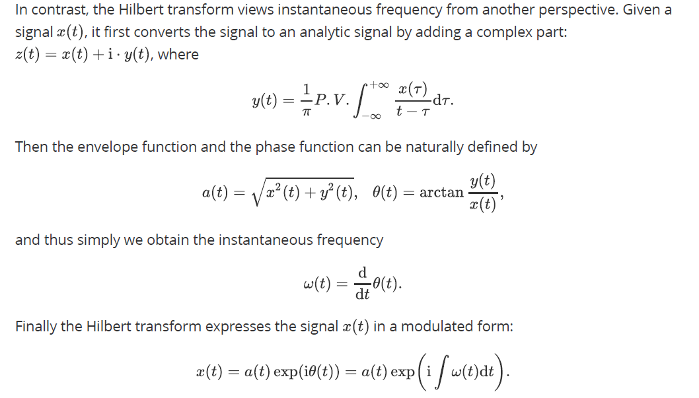
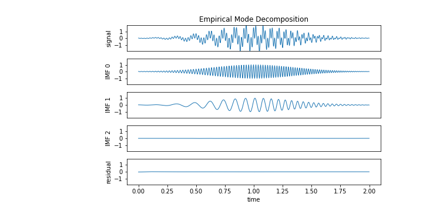
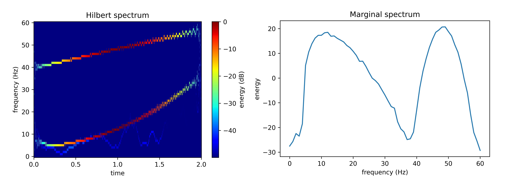

# Hilbert-Huang Transform

A demo of using Hilbert-Huang Transform (HHT) for non-stationary and non-linear signal analysis.


## Introduction

Time-frequency analysis is a fundamental topic in non-stationary signal processing.  Typical window-based methods (including short-time Fourier transform and wavelet transform)  assume that the system is linear, and thus they linearly project the signal into a family of predefined base functions (indexed by time and frequency) via integral transforms. Defining the time-frequency spectrum by integration, however, unavoidably results in the uncertainty rule: the energy distribution cannot concentrate well  well at the frequency and the temporal axis at the same time. In addition, linear assumption is not always justified, especially when nonlinear modulation exists. Although one might argue that for modulated signal there still exists a representation with the base functions (say, for example cos A cos B = 1/2 cos(A+B) + 1/2 cos(A-B), just a frequency shift), this would unnecessarily induce many annoying harmonics, which are indeed mathematical artifacts.

> Here we generate a mixture of two Gaussian-modulated chirp signals, with gradually increasing frequencies starting from 5Hz and 40Hz, respectively. The resulting signal is shown below.
>
> 
>
> The STFT results is also illustrated below. From the STFT spectrum, we can roughly seen the changes of the frequencies over time; however, due to the uncertainty principle, the frequency and temporal resolutions can not be fine enough at the same time. The Fourier analysis treats the non-linear modulation linearly, resulting in a blurred spectrum (consisting of a lot of energy leakage and unnecessary harmonics).
>
> 



However, the results produced by direct Hilbert transform are not always physically meaningful. In Huang et al. [1], they suggested that the signal should be decomposed into several components, such that each component (designated as intrinsic mode function (IMF) ) satisfies:

1. the upper envelope (*defined by its maxima*) and the lower envelope (*defined by its minima*) should be symmetric, and
2. there is exactly one zero-crossing between every two neighboring extrema.

Therefore, meaningful instantaneous frequency can be obtained from the Hilbert transform on each IMF component. To decompose the signal into several IMFs, we first extract an IMF function c<sub>1</sub>(t) from the data x(t), and then extract another IMF c<sub>2</sub>(t)  from x(t) - c<sub>1</sub>(t) , ..., until the residual r(t) = x(t) - c<sub>1</sub>(t)  - c<sub>2</sub>(t) - ... - c<sub>n</sub>(t) becomes ignorable or monotonic. When extracting a single IMF component, we also iteratively find the upper and lower envelope functions (*by using a cubic spline function crossing all maxima (for the upper envelope) or all minima (for the lower one)* ), and sift the data by subtracting the envelopes' mean; this process also repeats several times until the envelopes' mean becomes close enough to zero. 

The above algorithm is call empirical mode decomposition (EMD) by [1]. Then, the essential idea of Hilbert-Huang transform is performing Hilbert transform on each IMF component extracted by EMD, yielding

Therefore analyzing the envelope functions and the instantaneous frequency functions will provide us a more efficient representation of the oscillation properties, which directly analyze the non-linear modulation.

> Here is an illustration for the EMD on the mixing chirps. We can see than the two modulated chirps are successfully separated and represented by `IMF 0` and `IMF 1`. 
>
> 
>
> Now let's further visualize the time-frequency spectrum. We discard the spectrum in the first and last 0.25s since the endpoint effect would severely corrupt the low-frequency components in the spectrum.
>
> 
>
> In the illustration, the variation of frequencies over time can be clearly seen and consistent with our configuration - one increases linearly from 40Hz, reaching 50Hz at 1.2s, and the other increases quadratically from 5Hz, reaching 10Hz at 0.8s. From the color map one can observe that both of their amplitudes are modulated by a Gaussian envelope. In terms of the marginal spectrum, it also show two peaks of the frequency distribution, very similar to the Fourier transform result. 


## Implementation

We implement the Hilbert-Huang transform in *python*. The main algorithm is implement in [hht.py](hht.py). 

The example of the mixing chirps shown above is given in the *Jupyter notebook* [demo.ipynb](demo.ipynb). 


**Implementation details**:

* The stopping criteria of sifting process for extracting a single IMF (the center line is close enough to zero) is not used. The number of sifting times ( `num_sifting` ) is specified to be 10 by default.
* For convenience, the stopping criteria of EMD (the residual is monotonic or ignorable) is not used either.  So the number of IMFs to be extracted (`num_imf`) should be parsed to `torchHHT.hht.hilbert_huang`.
* We use cubic Hermite spline to extract the empirical envelope. To avoid the empirical envelope grows too high or drop too low at the two end, we force the gradient of the envelope function to be zero at -T/2 and T+T/2 (assuming that the total time span of the signal is [0, T]).


**Note for acceleration with GPU** 

The whole HHT are based on pytorch tensor computation. If you want to make use of GPU for acceleration, please put the signal on GPU before parsed into the relevant function. Here is an example:

```python
x = x.cuda()
imfs, imfs_env, imfs_freq = hht.hilbert_huang(x, fs, num_imf=3)
```

 

**Dependencies**  numpy, scipy, torch, matplotlib


**Update**

2021.06.20 

* Fix some bugs.
* Organize the code more elegantly. 
* Change the colormap of the spectrum.
* Use pytorch to compute cubic Hermite spline. Now the whole HHT are purely based on pytorch tensor computation, so it can be accelerated using GPU.

2020.10.17 Fix some bugs. Make use of pytorch to partly support tensor computation on GPU.


## Acknowledgement

Special thanks to professor Norden E. Huang for his substantial help. I have learned a lot from his remarkable insights into signal analysis and HHT.

 

## References

[1] Huang, Norden E., et al. "The empirical mode decomposition and the Hilbert spectrum for nonlinear and non-stationary time series analysis." *Proceedings of the Royal Society of London. Series A: mathematical, physical and engineering sciences* 454.1971 (1998): 903-995.

